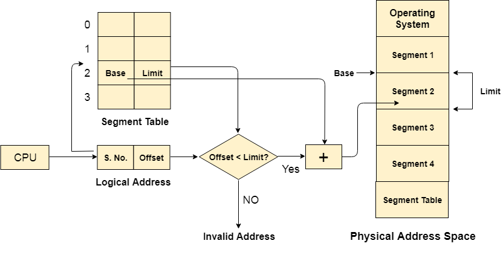

# segmentation

## Project setup

```
npm install
```

### Compiles and hot-reloads for development

```
npm run serve
```

### Compiles and minifies for production

```
npm run build
```

### Lints and fixes files

```
npm run lint
```

### Segmentation

In Operating Systems, Segmentation is a memory management technique in which, the memory is divided into the variable size parts. Each part is known as segment which can be allocated to a process.

The details about each segment are stored in a table called as segment table. Segment table is stored in one (or many) of the segments.

_Segment table_ contains mainly two information about segment:

1. Base: It is the base address of the segment.
2. Limit: It is the length of the segment.

CPU generates a _logical address_ which contains two parts:

1. Segment Number
2. Offset

The _Segment number_ is mapped to the segment table. The limit of the respective segment is compared with the _offset_. If the _offset_ is less than the limit then the address is valid otherwise it throws an error as the address is invalid.

In the case of valid address, the base address of the segment is added to the offset to get the physical address of actual word in the main memory.


